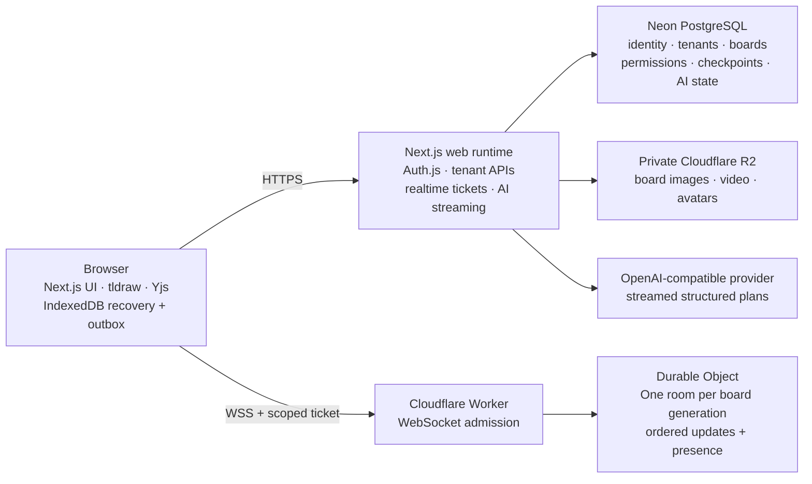

<div align="center">
  <a href="https://fabric.athrix.me">
    
  </a>

  <h3>Turn scattered thinking into shared direction.</h3>

  <p>
    An open-source, local-first multiplayer canvas for ideas, research, learning, and decisions.
  </p>

  <p>
    <a href="https://fabric.athrix.me"><strong>Open Fabric</strong></a>
    ·
    <a href="#quick-start"><strong>Quick start</strong></a>
    ·
    <a href="docs/setup.md"><strong>Full setup guide</strong></a>
    ·
    <a href="https://fabric.athrix.me/features"><strong>Features</strong></a>
    ·
    <a href="CONTRIBUTING.md"><strong>Contribute</strong></a>
  </p>

  <p>
    <a href="https://fabric.athrix.me"></a>
    
    
    
    
    <a href="LICENSE"></a>
  </p>

  <p>
    Made by <a href="https://athrix.me"><strong>Atharvsinh Jadav</strong></a>
  </p>
</div>

<p align="center">
  <a href="https://fabric.athrix.me">
    
  </a>
</p>

Fabric is a self-hostable visual workspace for teams, classrooms, and anyone who thinks better on a canvas. Bring notes, drawings, images, diagrams, research, comments, and decisions into one living board; collaborate in realtime; keep working through connection changes; and ask Fabric agent to propose structured edits that a person reviews before anything changes.

The interaction stays fast and local-first in the browser. Production trust is split deliberately: Next.js owns authenticated APIs, Cloudflare Durable Objects order multiplayer updates, Neon stores tenant and checkpoint truth, and private uploads live in Cloudflare R2.

> [!TIP]
> Want to explore before self-hosting? Open the live project at **[fabric.athrix.me](https://fabric.athrix.me)**. Want to run your own installation? Start with the [five-step local setup](#quick-start), then use the **[complete setup guide](docs/setup.md)** for OAuth, Neon roles, R2, Fabric agent, Cloudflare realtime, and production deployment.

## Contents

- [What Fabric gives you](#what-fabric-gives-you)
- [Made for teams and learning](#made-for-teams-and-learning)
- [How the collaboration model works](#how-the-collaboration-model-works)
- [Architecture](#architecture)
- [Quick start](#quick-start)
- [Enable the complete feature set](#enable-the-complete-feature-set)
- [Production topology](#production-topology)
- [Project structure](#project-structure)
- [Commands](#commands)
- [Documentation](#documentation)
- [Contributing](#contributing)
- [Creator and license](#creator-and-license)

## What Fabric gives you

| Area | What is included |
| --- | --- |
| **Multiplayer canvas** | Editable tldraw boards, Yjs convergence, named presence, smooth live cursors, comments, shared themes, and realtime collaboration |
| **Resilient editing** | IndexedDB recovery, a durable outgoing edit journal, reconnect handling, multi-tab coordination, and local draft export |
| **Workspace organization** | Workspaces, projects, board ownership and roles, favorites, pins, workflow statuses, archive/restore, search, and scoped sharing |
| **Visual thinking** | Drawing, text, shapes, connectors, media, templates, board navigation, bookmarks, minimap, and saved views |
| **Learning toolkit** | Calculator, graphing, equations, unit conversion, ruler, protractor, coordinate plane, focus timer, and education templates |
| **Private media** | Authorized image, video, and custom avatar uploads backed by private Cloudflare R2 buckets |
| **Fabric agent** | Streaming OpenAI-compatible planning, bounded visual context, native canvas proposals, preview, discard, and explicit apply |
| **Tenant safety** | Central server-owned access resolution across boards, projects, assets, comments, checkpoints, shares, AI, and realtime tickets |

### A whiteboard that remains editable

Fabric uses native canvas records instead of flattening normal work into screenshots. Diagrams, notes, connectors, study layouts, AI proposals, and imported media remain objects people can move, resize, restyle, discuss, and refine together.

### Multiplayer without fragile edits

Accepted edits are written to a local durable outbox before the network is trusted. Healthy collaboration uses one scoped WebSocket room per board generation, while reconnects, tab ownership changes, and temporary failures preserve pending work instead of silently discarding it.

### AI that proposes instead of taking over

Fabric agent receives a bounded, server-authorized view of the board and streams a structured plan. Fabric validates and compiles that plan into native canvas operations. The board does not change until an authorized editor reviews and applies the preview.

### Organization without browser-side tenant filtering

Board lists are always scoped to one workspace. Effective access is resolved on the server from workspace ownership, board ownership, direct board membership, project membership, and workspace roles. Private boards do not inherit access accidentally.

## Made for teams and learning

### For product and project teams

- Gather evidence, screenshots, diagrams, requirements, and discussion in one board.
- See who is online and follow live collaborator cursors.
- Move work through draft, active, review, and approved states.
- Organize boards into projects, pin important work, and archive without losing history.
- Ask Fabric agent for a workflow, synthesis, comparison, or structured plan and review the result before applying it.

### For students and teachers

- Start from lesson plans, KWL charts, vocabulary maps, lab reports, revision timetables, comparison diagrams, Cornell notes, and recall cards.
- Add graphs, equation cards, coordinate planes, measurement tools, and unit conversions directly to a board.
- Use personal focus tools and reusable study layouts without leaving the canvas.
- Collaborate on the same visual explanation while keeping every object editable.

### For self-hosters and builders

- Run the complete local stack from one Node.js process.
- Deploy production realtime independently to Cloudflare Workers and Durable Objects.
- Keep database, media, realtime, auth, and model credentials inside separate trust boundaries.
- Extend the product under the Apache-2.0 license.

## How the collaboration model works

1. **Open a board.** Fabric loads the latest durable checkpoint and the local recovery journal.
2. **Edit immediately.** Canvas changes update local Yjs state and enter the durable outgoing queue.
3. **Collaborate live.** A short-lived, tenant-scoped ticket joins the exact workspace, board, and document generation room.
4. **Commit in order.** The Durable Object validates candidate updates, persists them, and only then acknowledges and broadcasts them.
5. **Recover quietly.** Temporary network failures keep accepted local work queued for retry.
6. **Reauthorize when needed.** Membership, role, archive, restore, and generation changes are checked through server-owned access state.

Fabric intentionally avoids low authenticated edit-rate limits that would punish fast drawing, bulk paste, classrooms, workshops, shared offices, or reconnect recovery. Payload validation, bounded room state, backpressure, and slow-consumer protection remain in place.

## Architecture



| Runtime | Owns | Never trusts |
| --- | --- | --- |
| **Browser** | Canvas interaction, Yjs state, IndexedDB recovery, outgoing edits | Browser role or workspace claims as authorization |
| **Next.js** | Auth, tenant APIs, board tickets, media authorization, AI request delivery | Unvalidated IDs, origin headers, or client-supplied permissions |
| **Cloudflare** | WebSocket admission, ordered updates, presence, room snapshots, revocation fences | A socket before ticket verification |
| **Neon** | Users, workspaces, projects, permissions, boards, checkpoints, comments, AI state | Cross-tenant access without the effective-access resolver |
| **R2** | Private uploaded bytes | Public object access; authorization remains in Fabric |

The local development runtime combines these application processes behind one origin. The recommended production deployment keeps the web application and realtime transport separate. See the [production runbook](docs/production-runbook.md) for trust boundaries, rollout order, grants, health checks, and rollback.

## Quick start

This is the shortest path from a clean machine to a working local Fabric installation. Cloudflare, R2, and a paid AI provider are **not required for the first local boot**.

### 1. Install the prerequisites

- [Git](https://git-scm.com/)
- Node.js **22** with npm
- A PostgreSQL database; [Neon](https://neon.com/) is the supported reference
- Google and GitHub OAuth applications

Confirm Node.js before continuing:

```bash
node --version
```

The version must begin with `v22`.

### 2. Clone and install

macOS, Linux, or Git Bash:

```bash
git clone https://github.com/Atharvsinh-codez/Fabric.git
cd Fabric
npm ci
cp .env.example .env
```

Windows PowerShell:

```powershell
git clone https://github.com/Atharvsinh-codez/Fabric.git
Set-Location Fabric
npm ci
Copy-Item .env.example .env
```

### 3. Fill the first-boot environment

Open `.env` and replace the placeholders for:

| Required group | Variables |
| --- | --- |
| **Auth** | `AUTH_SECRET`, `AUTH_GOOGLE_ID`, `AUTH_GOOGLE_SECRET`, `AUTH_GITHUB_ID`, `AUTH_GITHUB_SECRET` |
| **Database** | `DATABASE_URL`, `DATABASE_URL_DIRECT`, `REALTIME_DATABASE_URL`, `WORKER_DATABASE_URL` |
| **Realtime** | `REALTIME_TICKET_SIGNING_KEY`, `REALTIME_TICKET_REDEMPTION_KEY`, `REALTIME_COORDINATOR_SECRET`, `REALTIME_REVOCATION_DISPATCH_SECRET` |

Generate a fresh secret with:

```bash
node -e "console.log(require('node:crypto').randomBytes(32).toString('base64url'))"
```

Run it separately for every secret; do not reuse one value across purposes. Register these exact local OAuth callbacks:

```text
Google: http://localhost:3000/api/auth/callback/google
GitHub: http://localhost:3000/api/auth/callback/github
```

Keep `AI_RUNS_ENABLED=false` for the first boot. R2 credentials are needed only when you enable private uploads. The [full setup guide](docs/setup.md) explains Neon runtime roles, every environment variable, and safe production secret ownership.

### 4. Prepare the database

```bash
npm run db:check
npm run db:migrate
```

When using the recommended separate Neon runtime roles, apply the [least-privilege grant block](docs/production-runbook.md#least-privilege-grants) as the database owner after migration. The migrator credential should never be used by the running application.

### 5. Start Fabric

```bash
npm run dev
```

Open **[http://localhost:3000](http://localhost:3000)**. Sign in, finish onboarding, create a workspace, and open the first board.

> [!IMPORTANT]
> `.env`, `.env.local`, `.env.worker.local`, and `.dev.vars*` contain secrets and are ignored by Git. Never commit them. Never put credentials in a `NEXT_PUBLIC_*` variable.

### What starts locally?

`npm run dev` starts one attached development runtime with:

- Next.js pages and authenticated APIs;
- the PostgreSQL-backed local Yjs WebSocket server at `ws://localhost:3000/realtime`;
- the durable AI worker, safely idle while `AI_RUNS_ENABLED=false`.

If any first-boot step fails, follow the **[complete Fabric setup guide](docs/setup.md)**. It contains platform-specific commands, exact OAuth configuration, Neon connection roles, troubleshooting, and production deployment.

## Enable the complete feature set

Start with the core local path, then add only the services you need:

| Capability | Additional service | Where to configure it |
| --- | --- | --- |
| **Private images, videos, and avatars** | Cloudflare R2 with a bucket-scoped S3 key and exact-origin CORS | [R2 setup](docs/setup.md#10-configure-private-cloudflare-r2) |
| **Fabric agent** | HTTPS OpenAI-compatible streaming Chat Completions provider | [Agent setup](docs/setup.md#11-configure-the-fabric-agent) |
| **Production multiplayer** | Cloudflare Worker plus two SQLite Durable Object classes | [Realtime deployment](docs/setup.md#12-deploy-cloudflare-realtime) |
| **Public web deployment** | Vercel or another compatible Next.js 16 host | [Web deployment](docs/setup.md#13-deploy-the-web-application) |
| **Cleanup and revocation delivery** | Host scheduler calling protected maintenance routes | [Scheduled maintenance](docs/setup.md#14-configure-scheduled-maintenance) |

The complete guide also covers fork identity, staging, canary rollout, private health checks, updating, and safe rollback.

## Production topology

Production is intentionally split:

- The **Next.js deployment** serves pages, Auth.js, tenant-aware APIs, media authorization, realtime tickets, and bounded AI streaming.
- The **Cloudflare Worker** accepts WebSockets and maps every document generation to one SQLite Durable Object room.
- **Neon** stores identity, organization, authorization, checkpoints, comments, assets, and AI job state.
- **R2** stores private media bytes; Fabric API routes remain the authorization boundary.

Recommended release order:

1. Create a Neon restore point.
2. Apply committed additive migrations and least-privilege grants.
3. Configure private R2 buckets and exact-origin CORS.
4. Deploy and health-check the Cloudflare realtime Worker.
5. Configure OAuth and the canonical web origin.
6. Deploy the Next.js application.
7. Validate staging, then one canary workspace, before wider enablement.

Never delete or rename deployed Durable Object classes, bindings, migration tags, or room storage during an update or rollback.

## Project structure

```text
app/                    Next.js pages, route handlers, and authenticated APIs
components/             Product UI, workspace UI, and whiteboard chrome
lib/                    Domain logic, authorization, clients, and contracts
db/                     Drizzle schema and ordered PostgreSQL migrations
cloudflare/realtime/    Production Worker and Durable Object implementation
realtime/               Attached local/custom-Node realtime runtime
worker/                 Durable AI dispatcher and processor
public/                 Fabric brand, icons, and product imagery
docs/                   Setup and production operations documentation
scripts/                Verification and brand-generation utilities
server.ts               All-in-one local/custom-Node entrypoint
wrangler.toml           Cloudflare Worker bindings and additive migrations
```

## Commands

| Command | Purpose |
| --- | --- |
| `npm run dev` | Start the complete attached local Fabric runtime |
| `npm run build` | Build Next.js and the attached Node server |
| `npm start` | Start the previously built attached Node server |
| `npm test` | Run the application Vitest suite |
| `npm run typecheck` | Type-check the Next.js application |
| `npm run lint` | Run ESLint |
| `npm run db:check` | Validate the committed Drizzle schema and migration metadata |
| `npm run db:migrate` | Apply committed migrations with the direct migrator URL |
| `npm run realtime:typecheck` | Type-check the attached realtime server |
| `npm run realtime:worker:typecheck` | Type-check the Cloudflare Worker |
| `npm run realtime:worker:test` | Run Worker tests in Cloudflare's Vitest pool |
| `npm run realtime:worker:types` | Check generated Worker binding types against `wrangler.toml` |
| `npm run ai-worker:typecheck` | Type-check the durable AI worker |
| `npm run verify:tldraw` | Verify the pinned tldraw version and reviewed patch |
| `npm run verify` | Run the main application, realtime, Worker, test, lint, and build gates |

## Documentation

- **[Complete setup guide](docs/setup.md)** — clean clone through local development, OAuth, Neon, R2, Fabric agent, Cloudflare realtime, production deployment, troubleshooting, and rollback.
- **[Cloudflare realtime guide](cloudflare/realtime/README.md)** — Durable Object development, deployment, cutover, smoke testing, secret rotation, and safe rollback.
- **[Production runbook](docs/production-runbook.md)** — least-privilege grants, rollout gates, health, retention, monitoring, backups, and incident response.
- **[Contributing guide](CONTRIBUTING.md)** — development workflow, engineering expectations, verification, and pull requests.
- **[Security policy](SECURITY.md)** — private vulnerability reporting and security expectations.
- **[Apache-2.0 license](LICENSE)** — permissions and conditions for using, modifying, and distributing Fabric.

## Contributing

Contributions are welcome across the canvas, realtime collaboration, accessibility, learning tools, documentation, tests, and developer experience.

1. Read [CONTRIBUTING.md](CONTRIBUTING.md).
2. Create a focused branch from current `main`.
3. Add or update tests for behavior changes.
4. Run `npm run verify` and the relevant database or Cloudflare checks locally.
5. Open a pull request that explains the user-visible outcome, risks, and verification.

Fabric intentionally pins `tldraw` to `4.2.0` and carries a reviewed patch. Do not change its version, patch, editor internals, shape behavior, or watermark handling without explicit maintainer approval and a licensing review.

## Security

Do not report vulnerabilities in a public issue. Follow [SECURITY.md](SECURITY.md) and use [GitHub private vulnerability reporting](https://github.com/Atharvsinh-codez/Fabric/security/advisories/new) when available.

Never commit `.env*`, OAuth credentials, database URLs, AI keys, R2 credentials, realtime secrets, session cookies, signed tickets, object keys, private board content, or presigned URLs.

## Creator and license

Fabric is designed and built by **[Atharvsinh Jadav](https://athrix.me)**.

[Portfolio](https://athrix.me) · [X](https://x.com/athrix_codes) · [LinkedIn](https://www.linkedin.com/in/atharvsinh-jadav) · [GitHub](https://github.com/Atharvsinh-codez)

Copyright 2026 Atharvsinh Jadav.

Fabric is open source under the **[Apache License 2.0](LICENSE)**.

## Built with

[Next.js](https://nextjs.org/) · [React](https://react.dev/) · [TypeScript](https://www.typescriptlang.org/) · [tldraw](https://tldraw.dev/) · [Yjs](https://yjs.dev/) · [Auth.js](https://authjs.dev/) · [Drizzle ORM](https://orm.drizzle.team/) · [Neon](https://neon.com/) · [Cloudflare Workers](https://developers.cloudflare.com/workers/) · [Durable Objects](https://developers.cloudflare.com/durable-objects/) · [Cloudflare R2](https://developers.cloudflare.com/r2/)

---

<div align="center">
  <strong>Open Fabric. Invite someone. Make one decision together.</strong>
  <br />
  <a href="https://fabric.athrix.me">fabric.athrix.me</a>
</div>
