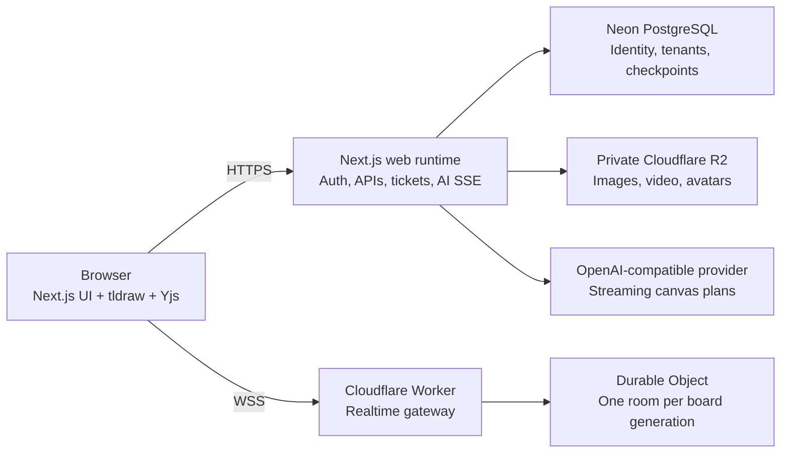

<div align="center">
  <a href="https://fabric.athrix.me">
    
  </a>

  <h3>A local-first multiplayer canvas for ideas, research, and shared decisions.</h3>

  <p>
    <a href="https://fabric.athrix.me"><strong>Live web</strong></a>
    ·
    <a href="docs/setup.md"><strong>Setup guide</strong></a>
    ·
    <a href="https://fabric.athrix.me/features"><strong>Features</strong></a>
    ·
    <a href="CONTRIBUTING.md"><strong>Contributing</strong></a>
  </p>

  <p>
    Made by <a href="https://athrix.me"><strong>Atharvsinh Jadav</strong></a>
  </p>

  <p>
    <a href="https://github.com/Atharvsinh-codez/Fabric/actions/workflows/ci.yml"></a>
    
    
    
    <a href="LICENSE"></a>
  </p>
</div>

---

Fabric is a self-hostable visual workspace built for teams, classrooms, and anyone who thinks better on a canvas. It combines an editable tldraw board with durable multiplayer sync, offline recovery, workspaces and projects, private media, study tools, and a human-reviewed canvas agent.

The browser stays responsive and local-first. In production, authenticated APIs run in Next.js, board rooms run in Cloudflare Durable Objects, tenant and checkpoint data lives in Neon PostgreSQL, and private uploads live in Cloudflare R2.

## Why Fabric

- **Realtime collaboration** — shared boards, named presence, multiplayer cursors, Yjs convergence, reconnect recovery, and a durable local outbox.
- **Organized work** — workspaces, projects, board roles, favorites, pins, statuses, archive/restore, comments, checkpoints, and scoped share links.
- **A serious whiteboard** — editable diagrams, drawings, canvas themes, templates, object navigation, bookmarks, minimap, and presentation-friendly layouts.
- **Built for learning** — calculators, graphing, equations, unit conversion, rulers, protractors, coordinate planes, focus tools, and education templates.
- **Private media** — board images, videos, and custom avatars stored in private R2 buckets behind Fabric authorization.
- **Reviewable AI** — an OpenAI-compatible streaming agent proposes native canvas changes that a person reviews before applying.
- **Tenant-aware by design** — board, project, workspace, asset, comment, AI, share, and realtime access resolve through server-owned authorization.

## Architecture



| Runtime | Owns |
| --- | --- |
| Browser | Canvas interaction, Yjs state, IndexedDB recovery, durable outgoing edits |
| Next.js | Auth.js, tenant-aware APIs, board tickets, media authorization, AI request delivery |
| Cloudflare | WebSocket admission, ordered Yjs updates, presence, Durable Object room storage |
| Neon | Users, workspaces, projects, permissions, boards, checkpoints, comments, AI state |
| R2 | Private uploaded bytes; metadata and access decisions remain in Neon |

For the complete trust boundaries and deployment order, read the [production runbook](docs/production-runbook.md).

## Quick start

Fabric requires Node.js 22, npm, a PostgreSQL/Neon database, and Google plus GitHub OAuth applications.

```bash
git clone https://github.com/Atharvsinh-codez/Fabric.git
cd Fabric
npm ci
cp .env.example .env
```

PowerShell equivalent:

```powershell
git clone https://github.com/Atharvsinh-codez/Fabric.git
Set-Location Fabric
npm ci
Copy-Item .env.example .env
```

After filling the environment values and preparing the database:

```bash
npm run db:check
npm run db:migrate
npm run dev
```

Open [http://localhost:3000](http://localhost:3000).

The environment has several deliberate trust boundaries, so do not guess the database roles or realtime secrets. Follow the **[complete setup guide](docs/setup.md)** for a working local stack, OAuth callbacks, private R2, and Cloudflare Durable Objects.

## Local and production runtimes

`npm run dev` starts the complete attached development runtime on one origin:

- Next.js pages and APIs
- the PostgreSQL-backed local WebSocket server
- the durable AI worker

Production is intentionally split. The Next.js deployment does not use `server.ts`; browsers connect directly to the deployed Cloudflare Worker at `wss://.../realtime`, and each board generation maps to one SQLite-backed Durable Object.

## Project structure

```text
app/                    Next.js pages, route handlers, and authenticated APIs
components/             Product UI, workspace UI, and whiteboard chrome
lib/                    Domain logic, authorization, clients, and contracts
db/                     Drizzle schema and ordered PostgreSQL migrations
cloudflare/realtime/    Production Worker and Durable Object implementation
realtime/               Attached local/custom-Node realtime runtime
worker/                 Durable AI dispatcher and processor
public/                 Fabric brand and product assets
docs/                   Setup and production operations documentation
server.ts               All-in-one local/custom-Node entrypoint
wrangler.toml           Cloudflare Worker bindings and migrations
```

## Common commands

| Command | Purpose |
| --- | --- |
| `npm run dev` | Start the complete local Fabric runtime |
| `npm test` | Run the Vitest suite |
| `npm run typecheck` | Type-check the Next.js application |
| `npm run lint` | Run ESLint |
| `npm run build` | Build Next.js and the attached Node server |
| `npm run db:check` | Validate the committed Drizzle schema and migrations |
| `npm run db:migrate` | Apply committed migrations using the direct migrator URL |
| `npm run realtime:worker:test` | Run Worker tests in Cloudflare's Vitest pool |
| `npm run realtime:worker:types` | Verify generated Worker binding types |
| `npm run verify` | Run the main application, realtime, lint, test, and build gates |

## Documentation

- **[Setup guide](docs/setup.md)** — local development, OAuth, Neon, AI, R2, Cloudflare realtime, and self-hosting.
- **[Cloudflare realtime guide](cloudflare/realtime/README.md)** — Durable Object deployment, cutover, smoke testing, and rollback.
- **[Production runbook](docs/production-runbook.md)** — grants, rollout gates, health, retention, monitoring, and incidents.
- **[Contributing guide](CONTRIBUTING.md)** — development workflow, quality gates, and tldraw constraints.
- **[Security policy](SECURITY.md)** — private vulnerability reporting and security expectations.

## Contributing

Contributions are welcome. Start with [CONTRIBUTING.md](CONTRIBUTING.md), keep changes focused, add tests for behavior changes, and run `npm run verify` before opening a pull request.

The tldraw dependency is intentionally pinned to `4.2.0`. Do not change its version, patch, internals, shape behavior, or watermark handling without explicit maintainer approval and a licensing review.

## Security

Please do not report vulnerabilities in a public issue. Follow [SECURITY.md](SECURITY.md) and use GitHub private vulnerability reporting when available. Never commit `.env*`, OAuth credentials, database URLs, AI keys, R2 credentials, realtime secrets, tickets, or presigned URLs.

## Creator

Fabric is made by [Atharvsinh Jadav](https://athrix.me).

[Portfolio](https://athrix.me) · [X](https://x.com/athrix_codes) · [LinkedIn](https://www.linkedin.com/in/atharvsinh-jadav)

## License

Copyright 2026 Atharvsinh Jadav.

Fabric is licensed under the [Apache License 2.0](LICENSE).

## Built with

[Next.js](https://nextjs.org/) · [React](https://react.dev/) · [tldraw](https://tldraw.dev/) · [Yjs](https://yjs.dev/) · [Auth.js](https://authjs.dev/) · [Drizzle ORM](https://orm.drizzle.team/) · [Neon](https://neon.com/) · [Cloudflare Workers and Durable Objects](https://developers.cloudflare.com/durable-objects/) · [Cloudflare R2](https://developers.cloudflare.com/r2/)
